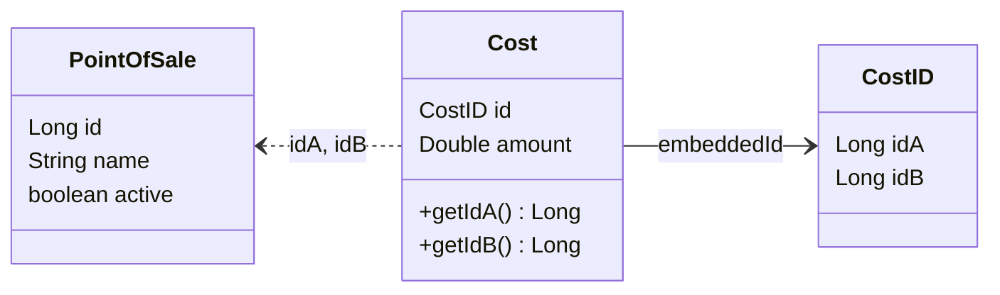

# 🧩 Proyecto de Microservicios con Spring Boot

Este proyecto es una implementación de una arquitectura de microservicios basada en Spring Boot. Utiliza tecnologías modernas como Redis, RabbitMQ y PostgreSQL para resolver problemas empresariales comunes de manera escalable, eficiente y modular.

## 🔧 Tecnologías Utilizadas

- Java 21
- Spring Boot 3.4.4
- Maven
- PostgreSQL
- Redis
- RabbitMQ
- Eureka Server (Service Discovery)
- Spring Cloud Gateway
- MapStruct
- Spring Data JPA
- Spring Validation
- Java Mail Sender
- ITextPDF
- Mailtrap
- Docker / Podman
- Postman / DBBeaver
- Open Api (Swagger)
- Junit / Mockito
- H2 Database (Testing)
- Jacoco + informe en HTML
- SonarQube (Revisión de cobertura)

---

## 📌 Módulo: Punto de Venta (Point of Sale)

Este módulo forma parte de una arquitectura de microservicios, y está diseñado para gestionar los Puntos de Venta. Su propósito es ofrecer una API REST que permita registrar, consultar, actualizar, eliminar y listar puntos de venta activos de forma eficiente, utilizando una base de datos relacional (JPA) para la persistencia y Redis como capa de caché para mejorar el rendimiento de las consultas.

### ⚙️ Características Técnicas

- Persistencia con Spring Data JPA.
- Cacheo en Redis de puntos de venta activos.
- Validación de entradas con Spring Validation.
- Mapeo entre entidades y DTOs con MapStruct.
- Soft delete (borrado lógico) y operaciones transaccionales (`@Transactional`).
- Manejo de errores unificado.
- Estructura de respuesta estándar con `ApiResponseDTO`.

### 🔁 Endpoints del Controlador `PointOfSaleController`

| Método | Endpoint                      | Descripción |
|--------|-------------------------------|-------------|
| POST   | `/api/pointOfSale/add`        | Crea un nuevo punto de venta. |
| GET    | `/api/pointOfSale/{id}`       | Obtiene un punto de venta por ID (cacheado). |
| GET    | `/api/pointOfSale/getAll`     | Lista todos los puntos de venta activos. |
| PUT    | `/api/pointOfSale/update`     | Actualiza parcialmente un punto de venta. |
| DELETE | `/api/pointOfSale/delete/{id}`| Realiza una baja lógica del punto de venta. |

---

## 📌 Módulo: Costos (Cost)

Este módulo forma parte de una arquitectura de microservicios, y está diseñado para gestionar los Costos asociados los puntos de venta. Su propósito es ofrecer una API REST que permita agregar un costo a dos puntos de ventas determinados, eliminar el costo de dos puntos de ventas determinados, consultar el costo de un punto venta determinado y encontrar el costo minimo entre 2 puntos de ventas utilizando el algoritmo dijkstra, todo esto de manera eficiente, con persistencia en base de datos relacional (JPA) y cacheo de datos activos utilizando Redis para mejorar el rendimiento de las consultas frecuentes.

### ⚙️ Características Técnicas

- Persistencia con Spring Data JPA.
- Cacheo en Redis de costos activos.
- Validación con Spring Validation.
- Mapeo de DTOs con MapStruct.
- Soft delete (borrado lógico) y transacciones (`@Transactional`).
- Manejo de errores centralizado.
- Uso de `ApiResponseDTO` para respuestas consistentes.

### 🔁 Endpoints del Controlador `CostController`

| Método | Endpoint                        | Descripción |
|--------|---------------------------------|-------------|
| POST   | `/api/cost/add`                 | Permita agregar un costo a dos puntos de ventas.  |
| GET    | `/api/cost/direct/{id}`         | Consultar el costo de un punto venta determinado. |
| GET    | `/api/cost/minimum/{idA}/{idB}` | Encontrar el costo mínimo entre 2 puntos de venta. |
| DELETE | `/api/cost/delete/{idA}/{idB}`  | Eliminar el costo de dos puntos de ventas. |

---

## 🔄 Flujo General
```
Client
  ⬇
Controller (Valida DTO)
  ⬇
Service (Negocio + Cacheo)
  ⬇
Mapper (MapStruct)
  ⬇
Entity ↔ Repository (JPA)
  ⬇
Redis Cache (Hash por ID)
```
---

## 🔎 Patrones de diseño utilizados:

- Arquitectura por Capas (Controller-Service-Repository)
- Inyección de Dependencias (Dependency Injection)
- Patrón Data Mapper
- Patrón DTO
- Patrón de Cacheo
- Arquitectura Orientada a Eventos (Event-Driven Architecture)
- Template Method
- Role-Based Access Control
- Manejo Centralizado de Excepciones (Exception Handling Pattern):
- Singleton
- Factory
- Strategy (Role Validator)

---

## 🚀 Levantar el Proyecto con Podman Compose

### 🔸 Pre-requisitos

- Tener instalado `Podman` y `Podman Compose`.
- Crear un archivo `.env` con las siguientes variables:
```.env
POSTGRES_USER=postgres
POSTGRES_PASSWORD=postgres
POSTGRES_DB=myappdb

SPRING_DATASOURCE_USERNAME=postgres
SPRING_DATASOURCE_PASSWORD=postgres

SECRET_KEY=B374A26A71421437AA024E4FADD5B478FDFF1A8EA6FF12F6FB65AF2720B59CCF
```

- docker-compose.yml:

```
version: '3.8'

services:
  postgres:
    image: postgres:16
    container_name: springboot_postgres
    restart: always
    ports:
      - "5432:5432"
    environment:
      POSTGRES_USER: ${POSTGRES_USER}
      POSTGRES_PASSWORD: ${POSTGRES_PASSWORD}
      POSTGRES_DB: ${POSTGRES_DB}
    volumes:
      - postgres_data:/var/lib/postgresql/data
    networks:
      - spring-network

  redis:
    image: redis:7.2
    container_name: redis_cache
    restart: always
    ports:
      - "6379:6379"
    networks:
      - spring-network

  rabbitmq:
    image: rabbitmq:3-management
    container_name: rabbitmq
    restart: always
    ports:
      - "5672:5672"   # Puerto de conexión para microservicios
      - "15672:15672" # Puerto de panel web de administración
    environment:
      RABBITMQ_DEFAULT_USER: guest
      RABBITMQ_DEFAULT_PASS: guest
    networks:
      - spring-network

  eureka:
    build: ./eureka_server
    container_name: eureka_server
    ports:
      - "8761:8761"
    networks:
      - spring-network

  gateway:
    build: ./cloud-gateway
    container_name: gateway_service
    ports:
      - "8080:8080"
    depends_on:
      - eureka
    environment:
      - SECRET_KEY=${SECRET_KEY}
    networks:
      - spring-network

  pointsalecost:
    build: ./Point_of_Sale_Cost-Microservice
    container_name: pointsalecost_service
    depends_on:
      - postgres
      - redis
      - eureka
    environment:
      - SPRING_DATASOURCE_USERNAME=${SPRING_DATASOURCE_USERNAME}
      - SPRING_DATASOURCE_PASSWORD=${SPRING_DATASOURCE_PASSWORD}
    networks:
      - spring-network

  accreditations:
    build: ./Accreditation-Microservice
    container_name: accreditations_service
    depends_on:
      - postgres
      - redis
      - eureka
      - rabbitmq
    environment:
      - SPRING_DATASOURCE_USERNAME=${SPRING_DATASOURCE_USERNAME}
      - SPRING_DATASOURCE_PASSWORD=${SPRING_DATASOURCE_PASSWORD}
    networks:
      - spring-network

  usermicroservice:
    build: ./Users-Microservice
    container_name: usermicroservice_service
    depends_on:
      - postgres
      - redis
      - eureka
      - rabbitmq
    environment:
      - SPRING_DATASOURCE_USERNAME=${SPRING_DATASOURCE_USERNAME}
      - SPRING_DATASOURCE_PASSWORD=${SPRING_DATASOURCE_PASSWORD}
      - SECRET_KEY=${SECRET_KEY}
    networks:
      - spring-network

  emailrabbitmq:
    build: ./emailRabbitMQ-Microservice
    container_name: email_rabbitmq_service
    depends_on:
      - rabbitmq
    environment:
      - SECRET_KEY=${SECRET_KEY}
    ports:
      - "8084:8084"
    networks:
      - spring-network

volumes:
  postgres_data:

networks:
  spring-network:
    driver: bridge

```

- Comando para construir y levantar con Podman Compose:
`podman compose up --build`

## ✅ Estructura de la Carpeta


# ⚙️ Test unitarios

## Jacoco + informe en HTML


##  Sonar Qube


## 🧩 Swagger | Open API


Endpoint swagger: http://localhost:8080/swagger-ui/index.html


## 📊 Diagrama de clases




## 💻​ Diagrama del Flujo General de la Aplicación


